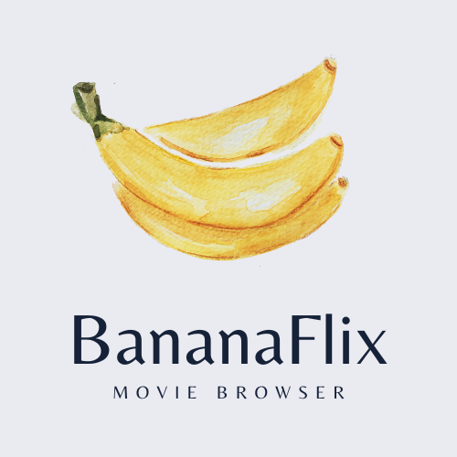

  
   

  <h3><b>BananaFlix-React-client</b></h3>

<!-- TABLE OF CONTENTS -->

# 📗 Table of Contents

- [📖 About the Project](#about-project)
  - [🛠 Built With](#built-with)
    - [Tech Stack](#tech-stack)
    - [Key Features](#key-features)
  - [🚀 Live Demo](#live-demo)
- [💻 Getting Started](#getting-started)
  - [Setup](#setup)
  - [Prerequisites](#prerequisites)
  - [Install](#install)
  - [Usage](#usage)
  - [Run tests](#run-tests)
  - [Deployment](#triangular_flag_on_post-deployment)
- [👥 Authors](#authors)
- [🔭 Future Features](#future-features)
- [🤝 Contributing](#contributing)
- [🙏 Acknowledgements](#acknowledgements)

<!-- PROJECT DESCRIPTION -->

# 📖 BananaFlix-React-client 

**BananaFlix-React-client** is the client side of a movie browsing app, made with React-Bootstrap. It allows users to register, log in and browse through movies. They can add movies to their list of favorites and they can view them and their profile details in the ProfileView, where they can also edit user details. The purpose of the project was to learn React as part of the CareerFoundry curriculum. It is part of a larger full-stack project and one of two clients (the other made with Angular) using the same backend. 

## 🛠 Built With React-Bootstrap and JSX

### MERN 

Database

  <ul>
    <li><a href="https://www.mongodb.com/">MongoDB</a></li>
  </ul>

  
Server

  <ul>
    <li><a href="https://expressjs.com/">Express.js</a></li>
  </ul>

  
Client

  <ul>
    <li><a href="https://reactjs.org/">React.js</a></li>
  </ul>

Database

  <ul>
    <li><a href="https://nodejs.org/">Node.js</a></li>
  </ul>

<!-- Features -->

### Key Features 

- **Displays a welcome view where users will be able to either log in or register an account**
- **Once authenticated, the user can view all movies**
- **Users can navigate to a single MovieView**
- **Additional details like genre information, director biography and movie description can be found in the MovieView**
- **Users can add favorite movies to their list of favorites which can be seen in their ProfileView**
- **Users can edit their profile information in the ProfileView, and they can delete their account**

(<a href="#readme-top">back to top</a>)

<!-- LIVE DEMO -->

## 🚀 Live Demo 

- [Live Demo Link](https://banana-flix.netlify.app/login)

(<a href="#readme-top">back to top</a>)

<!-- GETTING STARTED -->

## 💻 Getting Started 

To get a local copy up and running, follow these steps.

### Prerequisites

In order to run this project you need:

parcel

### Setup

Clone this repository to your desired folder

### Install

Install this project with:

npm install

### Usage

To run the project, execute the following command:

npm run start

### Deployment

You can deploy this project using:

parcel build src/index.html --public-url /

(<a href="#readme-top">back to top</a>)

<!-- AUTHORS -->

## 👥 Author

👤 **Nikola Stefanovski**

- GitHub: [@S-Nikola](https://github.com/S-Nikola)

(<a href="#readme-top">back to top</a>)

<!-- CONTRIBUTING -->

## 🤝 Contributing 

Contributions, issues, and feature requests are welcome!

(<a href="#readme-top">back to top</a>)

<!-- ACKNOWLEDGEMENTS -->

## 🙏 Acknowledgments 

I would like to thank Ramadhan Aheebwa and Ayeah Godlove Akoni (My CareerFoundry mentor and tutor respectively) for their help during the learning and development process. 

(<a href="#readme-top">back to top</a>)

